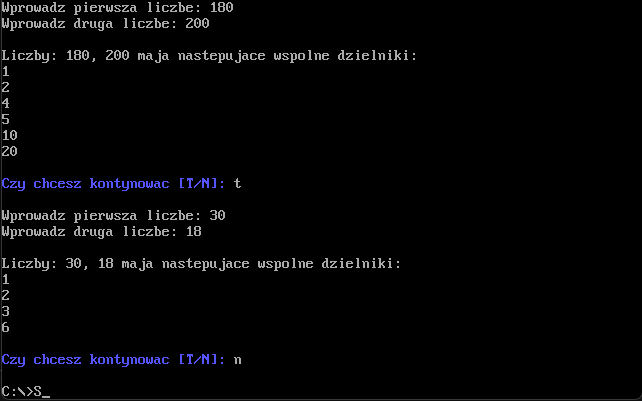
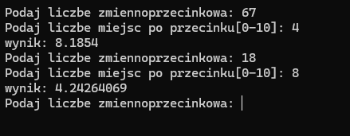

# Projects Overview

## Project 1: Common Divisors Finder (`proc.asm`)

This project creates a `.com` file that allows you to find all common divisors of two specified numbers. It operates on systems that support `.com` files, such as Windows 7 and older. For newer systems, it can only be run on DOSBox.

### Features

- Prompts the user to enter two numbers.
- Calculates and displays all common divisors of the entered numbers.
- Supports interactive continuation or termination of the program.

## Project 2: Square Root Finder (`pierwiastek_interface.c` and `pierwiastek_procedure.asm`)

This project finds the square root of a selected number with a specified precision using Heron's algorithm. The project can be run on computers with Windows and operates in 32-bit mode.

### Features

- Prompts the user to enter a floating-point number.
- Prompts the user to enter the number of decimal places for precision (0-10).
- Calculates and displays the square root of the entered number using Heron's algorithm.